# Angular-10-AbsenceManager
 
This project was generated with [Angular CLI](https://github.com/angular/angular-cli) version 10.

## How To install and run this repository in your local machine

Use git clone or download the folder to your local machine. Then run 

    npm install 

to download the required node modules in your downloaded folder. Then start the application using
	
    ng serve -o 

which opens the application in localhost:4200 and your system requires a recent Node version installed for running above code.

# AbsenceManager Details

* The application is in Angular 10 with recent version of Node and used Angular material component library, SCSS, flexbox layout module. 
* Application Unit testing is done with Karma and Jasmine and maintained more than 96% code coverage. 
* Application is fully responsive.
* The Application uses the API responses in json files and data available only within 2017 Jan - 2017 December time frame.
* Angular Material Table with sort and pagination feature is used.

# AbsenceManager Features

* Landerpage shows a list of absences including the names of the employee 
* Landerpage have a toggle grid button to view 2 grid or 3 grid card view.
* Absence List can see vacations of my employees as "#{member.name} is on vacation" and see sickness of my employees as "#{member.name} is sick"
* Use Export Buttons in the application to export employees absences to outlook calendar( iCal / .ics File)
* Use User ID Search Button provided in the application or Hit Url Directly( eg: http://localhost:4200?userId=624 ) to receive the absences of the given user 
* Use Calendar Search button in the application or Hit Url Directly (eg: http://localhost:4200?startDate=2017-01-01&endDate=2017-02-01) and only receive the absences in the given date range.
* Page not found page for unknown pages or users.
* Show Absence List Empty  for members with no absence list or if Absence in a Date range is empty

## Build

Run `ng build` to build the project. The build artifacts will be stored in the `dist/` directory. Use the `--prod` flag for a production build.

## Running unit tests

Run `ng test` to execute the unit tests via [Karma](https://karma-runner.github.io).

## Running end-to-end tests

Run `ng e2e` to execute the end-to-end tests via [Protractor](http://www.protractortest.org/).

## App Screenshots

* Mobile - landerpage

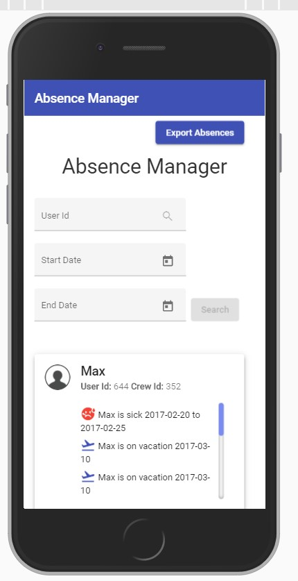

* Mobile - Single User Search

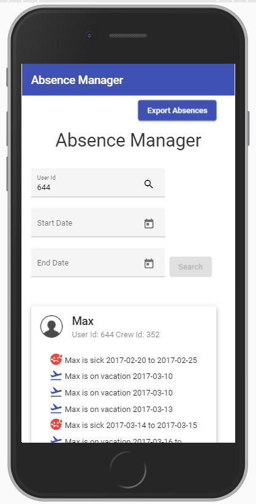

* Mobile - Absence in a date range

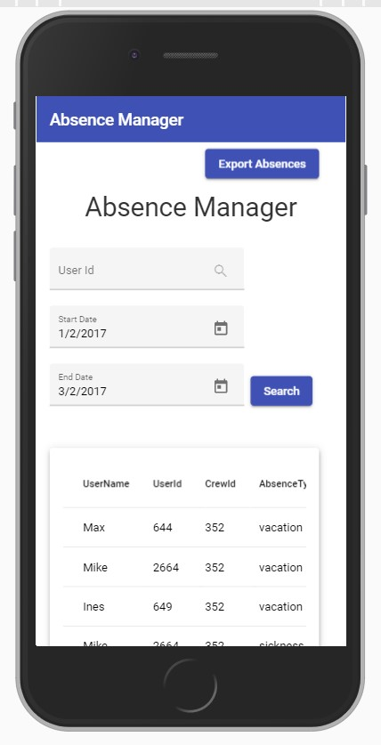

* Mobile - Empty Absence list in a date range

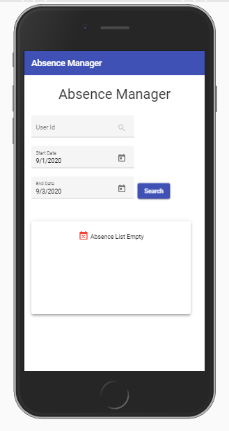

* Mobile - Empty Absence list for a user

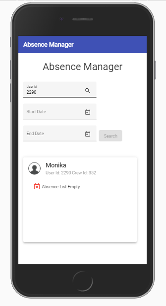

* Mobile - page not found

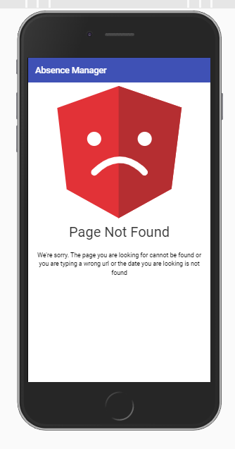

* ipad - landerpage

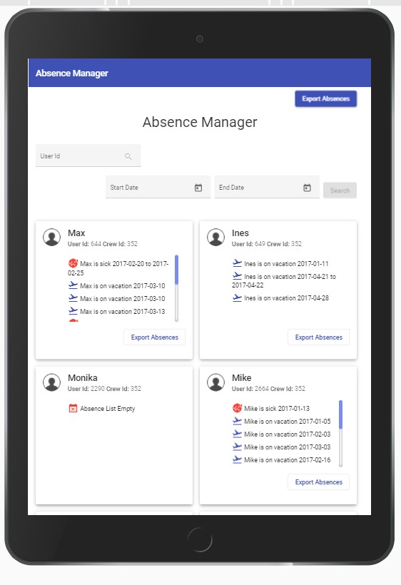

* ipad - Single User Search

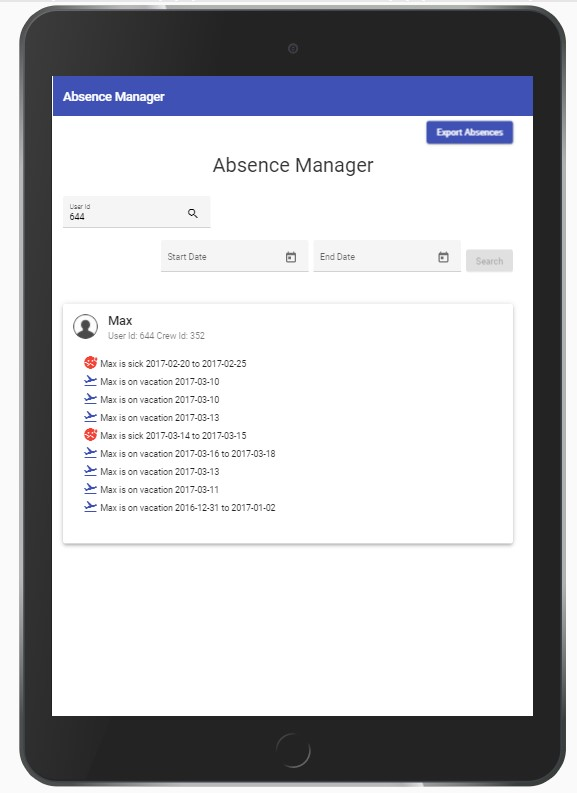

* ipad - Absence in a date range

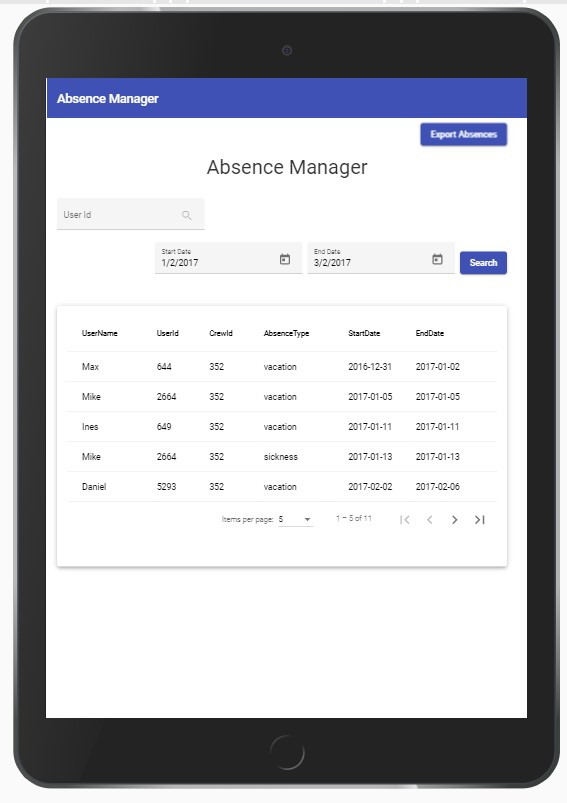

* laptop - landerpage- 2 Grid

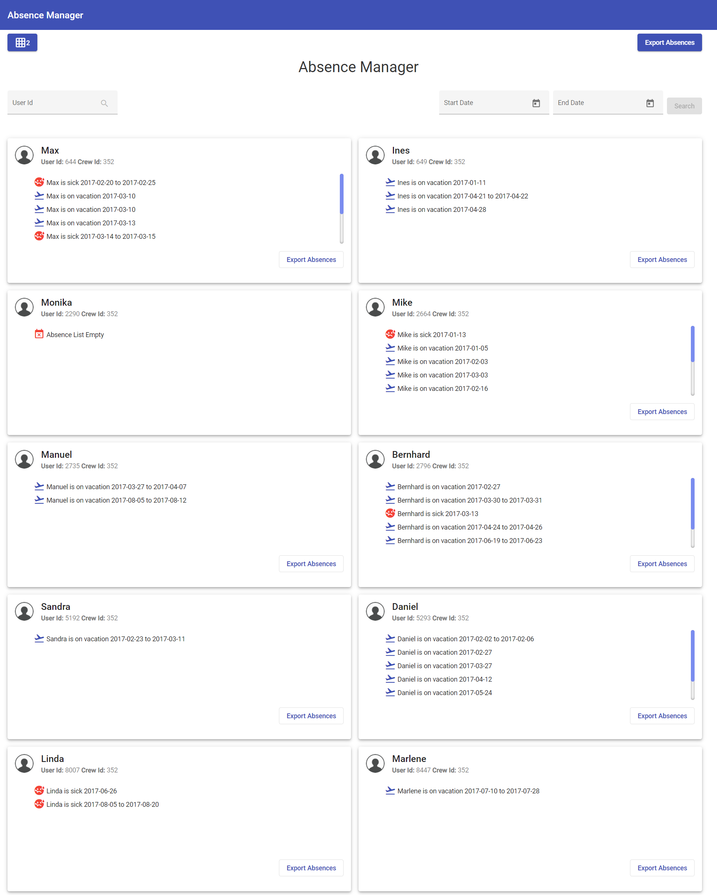

* laptop - landerpage- 3 Grid

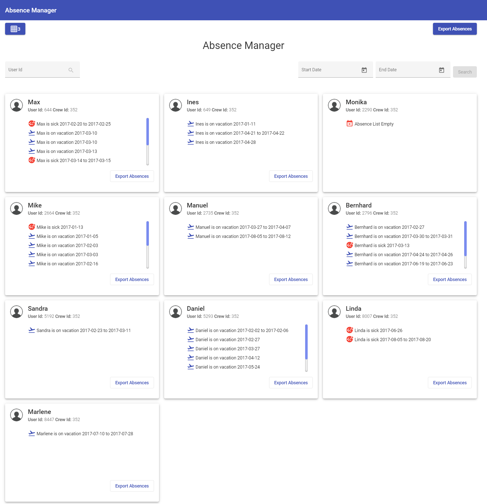

* laptop - Single User Search

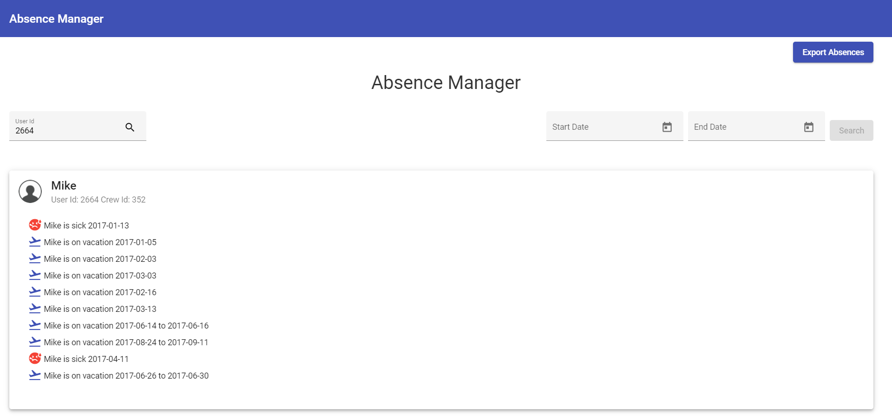

* laptop -  Absence in a date range

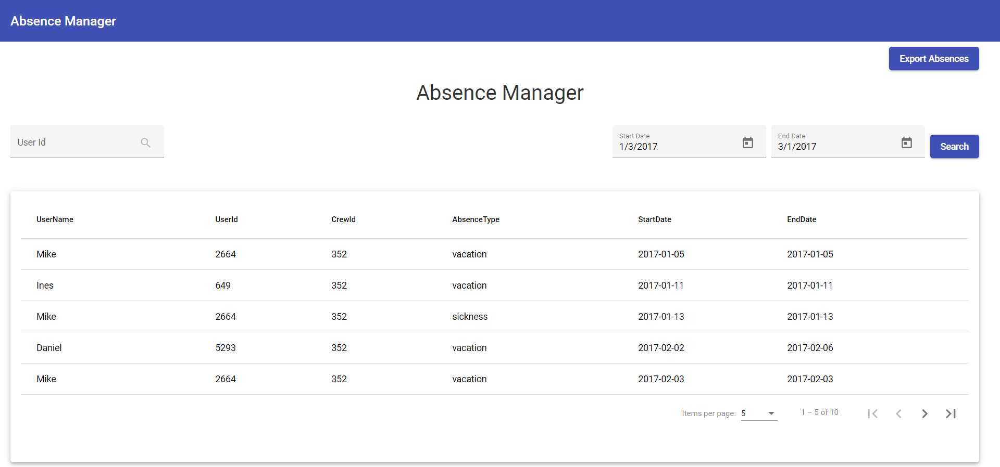

* Export Absence - Imported calendar

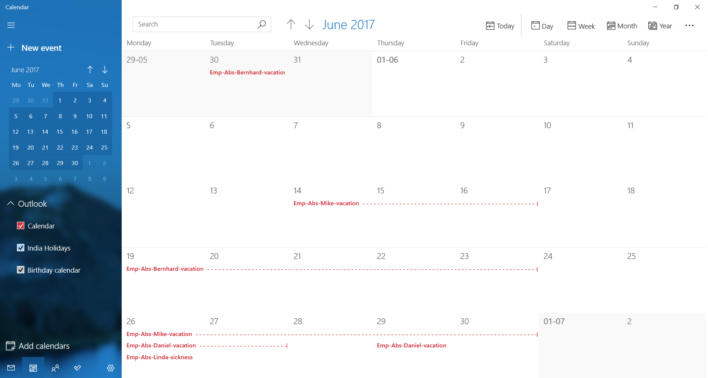

* Export Absence - ICS Events

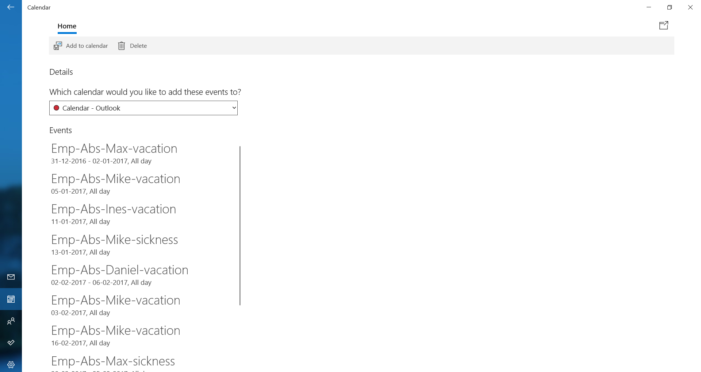

* Code Coverage

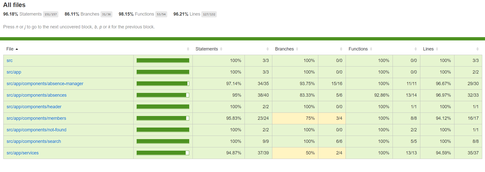

## Further help

To get more help on the Angular CLI use `ng help` or go check out the [Angular CLI README](https://github.com/angular/angular-cli/blob/master/README.md).
